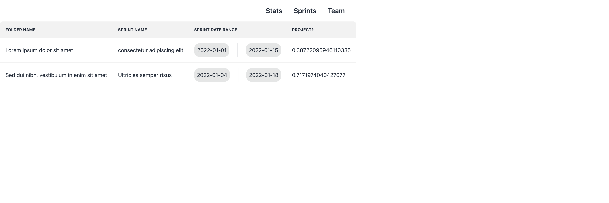

# Welcome to Marathon.

## Aim
To be the very best that ever was.

## How
Help devs teams track their team member efforts and team stats for scrum or general development process

## What
An app to save and structure teams, save tasks completed and context on sprint effort and generate stats and reports on how the team is doing based on the input and historical data

## How it looks so far
A sample "user stats" view where we can display sprints the user belongs to

# Plans
- Integrate with AWS Cognito ✅
- Access DynamoDB with identity credentials
- Get user info from tables
  - Sprints they belong to
  - Teams they belong to
  - Resolved tasks within a time frame (maybe?)
  - Current open tasks(maybe?)
  - MTTR (median time to resolution)
  - Etc

Once this last step is completed there will be a data abstraction layer to provide connectors to popular databases or for other people to provide their own data storage implementations.

# Using
- React (duh)
- AWS Cognito
- [tailwind css](https://tailwindcss.com/)
- [DaisyUI](https://daisyui.com/) 
- Dreams ✨
- Imagination 🌈